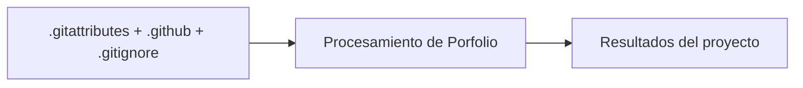

# Portfolio - Horacio Laphitz

## Descripción

Professional portfolio built with Astro, React, and Tailwind CSS. Deployed on GitHub Pages with automated CI/CD.

## 🚀 Tech Stack

- **Framework**: Astro 5.x
- **UI Library**: React 18
- **Styling**: Tailwind CSS 3
- **Language**: TypeScript 5
- **Testing**: Vitest
- **Deployment**: GitHub Pages
- **CI/CD**: GitHub Actions
- **Package Manager**: pnpm 9

## 🔗 Links

- **Portfolio**: [horaciolaphitz.github.io](https://horaciolaphitz.github.io)
- **LinkedIn**: [linkedin.com/in/horacio-laphitz](https://linkedin.com/in/horacio-laphitz)
- **GitHub**: [github.com/HoracioLaphitz](https://github.com/HoracioLaphitz)
- **Credly**: [credly.com/users/horacio-laphitz](https://www.credly.com/users/horacio-laphitz)

## 📧 Contact

**Email**: <horaciolaphitz99@gmail.com>

## 📄 License

MIT License © 2026 Horacio Laphitz

---

Horacio Laphitz

## Diagrama

[Explorar la arquitectura interactiva en GitDiagram](https://gitdiagram.com/HoracioLaphitz/Porfolio)

## Tecnologías

- Astro
